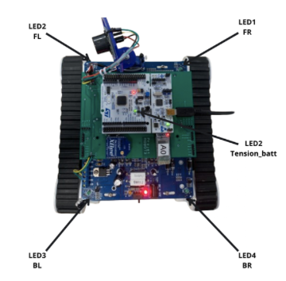
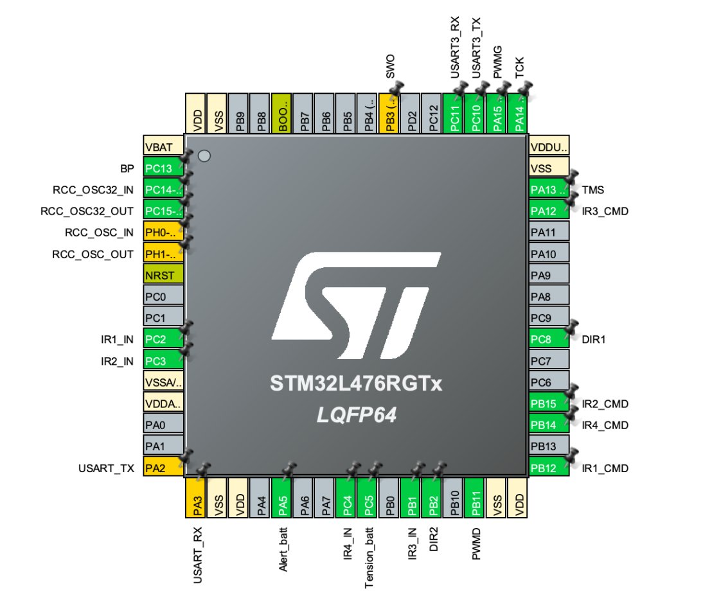
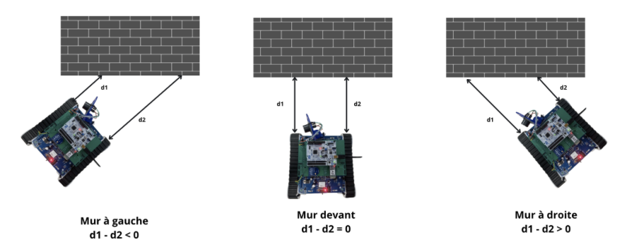
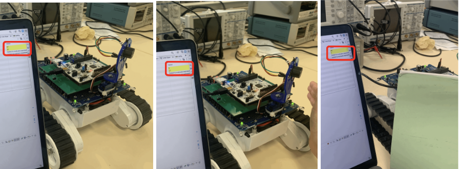
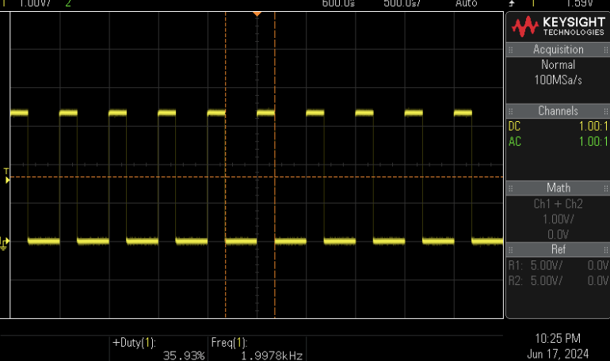
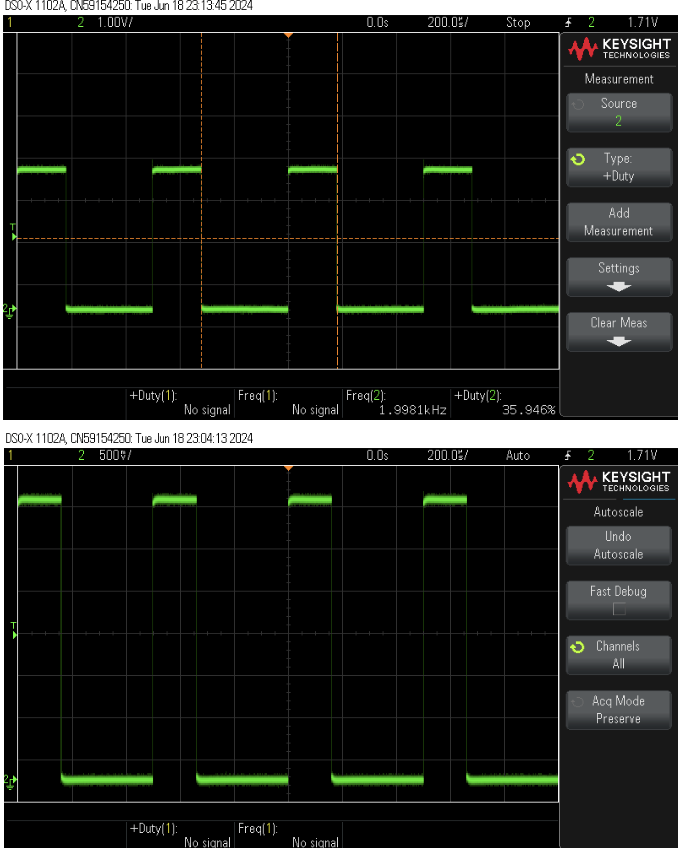

# Autonomous Robot Project

## Description

This project focuses on designing and building an autonomous robot capable of receiving commands via Bluetooth and navigating independently while avoiding obstacles. The robot is programmed to meet specific requirements, including obstacle avoidance, battery management, and the ability to resume its path after any interruptions.

## Key Features

- **Bluetooth Control**: The robot can be controlled via a mobile application using Bluetooth to move forward, turn left or right.
  
- **Obstacle Avoidance**: When the robot detects an obstacle within 20 cm, it autonomously avoids collisions by turning in the direction where there is no obstacle.

- **Battery Monitoring**: The robot uses an Analog Watchdog to monitor battery levels and triggers an alert LED when the battery is low.

- **Obstacle Handling**: Once the obstacle is cleared, control returns to the user for manual navigation.

---

## Table of Contents

1. [Project Overview](#project-overview)
2. [Hardware Configuration](#hardware-configuration)
3. [Software Overview](#software-overview)
   - [Pin Initialization](#pin-initialization)
   - [PWM Signal Configuration](#pwm-signal-configuration)
   - [Bluetooth Module Initialization](#bluetooth-module-initialization)
   - [Battery Management](#battery-management)
4. [Obstacle Avoidance System](#obstacle-avoidance-system)
5. [Improvement Ideas](#improvement-ideas)
6. [Testing and Results](#testing-and-results)
7. [Conclusion](#conclusion)

---

## Project Overview

The goal of this project is to design and implement a fully autonomous robot as part of an embedded systems course. The robot interacts with a mobile phone via Bluetooth for user commands, automatically avoids obstacles, manages its battery levels, and resumes its previous path after stopping.

## Hardware Configuration

The robot is built using the following components:

- **STM32 Microcontroller**: For processing and handling the robot’s movements.
- **Bluetooth Module**: To receive commands from a mobile application.
- **IR Sensors**: For obstacle detection.
- **Motors**: To control the movement using PWM signals.
- **Battery and Monitoring Circuit**: For power management.

For more information, see the flowchart. 

## Software Overview

### Pin Initialization

The robot’s hardware is controlled through a carefully mapped pin configuration in CubeIDE. The pins are configured to handle the motors, IR sensors, and communication peripherals.

### PWM Signal Configuration

The robot moves via two motors controlled by PWM signals. The frequency is set at 2 kHz, and speed control is achieved by adjusting the duty cycle.

### Bluetooth Module Initialization

Bluetooth allows user control via a mobile application. The robot receives direction commands and acts based on the first character of the input.

### Battery Management

Battery levels are monitored through an Analog Watchdog feature. When the battery voltage drops below a defined threshold, the robot triggers an LED to alert the user.

---

## Obstacle Avoidance System

The obstacle detection system relies on four IR sensors placed around the robot. The sensors continuously scan for obstacles, and if the robot approaches within 20 cm of a wall, it executes an avoidance maneuver.

---

## Improvement Ideas

Future improvements to this project could include:

- **Rear Infrared LEDs**: Adding rear sensors for more efficient obstacle detection when reversing.
- **Sonar Integration**: Adding a sonar sensor for better distance accuracy in environments with poor lighting.

---

## Testing and Results

All the features, including Bluetooth control, PWM motor management, and obstacle avoidance, were thoroughly tested in various environments. The Bluetooth connection was stable even at a distance of 20 meters, and the PWM signals correctly controlled motor speed.

---

## Conclusion

This autonomous robot successfully fulfills the requirements of Contract No. 6 by implementing Bluetooth control, obstacle avoidance, and battery management. Future improvements and more sensors can expand its functionality and make it more robust in different environments.
